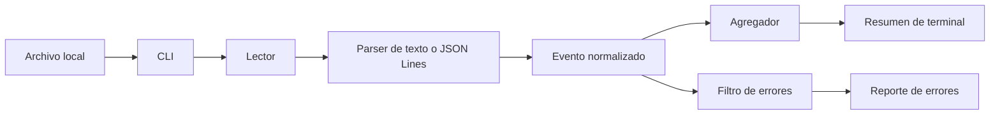

# Roadmap — Analizador de logs

## Objetivo de la primera versión

Construir una herramienta CLI local en Python 3.11+ que procese un archivo de logs de texto común o JSON Lines, normalice los eventos válidos, presente un resumen agregado y permita obtener un reporte filtrado de errores. La ejecución será local, no requerirá servicios externos y deberá poder demostrarse mediante fixtures incluidos en el proyecto.

## Supuestos y límites iniciales

- Un análisis procesa un único archivo de entrada por ejecución.
- La CLI recibirá el formato de manera explícita mediante una opción; la detección automática queda fuera de la primera versión para evitar resultados ambiguos.
- El formato de texto común se definirá y documentará en la fase de contrato. La propuesta inicial es una línea por evento con marca temporal, nivel y mensaje.
- Cada línea JSON Lines deberá representar un objeto JSON independiente y el contrato fijará los campos mínimos equivalentes a marca temporal, nivel y mensaje.
- Las líneas inválidas se contabilizarán y se reportarán de manera accionable; no detendrán el análisis salvo que la entrada sea ilegible o no contenga ningún evento válido, decisión que se cerrará en la fase de interfaz.
- El resumen incluirá el total de eventos válidos, eventos no interpretables, distribución por nivel y mensajes más frecuentes. El reporte filtrado mostrará eventos de nivel de error o superior según la política de severidad documentada.
- La primera versión no vigilará archivos en tiempo real, no agrupará múltiples archivos, no enviará alertas y no persistirá resultados.

## Flujo de procesamiento previsto

1. La CLI valida argumentos, ruta y formato solicitado.
2. El lector consume el archivo de forma secuencial para contener el uso de memoria.
3. El parser seleccionado interpreta cada línea y produce un evento normalizado o un diagnóstico de línea inválida.
4. El agregador calcula contadores por nivel y recurrencia de mensajes.
5. El filtro selecciona eventos que cumplen el umbral de error definido.
6. El presentador escribe un resumen y, cuando se solicite, el reporte filtrado en la terminal.

## Arquitectura y componentes

| Componente | Responsabilidad | Relación principal |
|---|---|---|
| `main.py` | Punto de entrada, argumentos CLI, códigos de salida y coordinación del flujo. | Invoca lectura, parseo, análisis y presentación sin contener reglas de interpretación. |
| `parsers.py` | Contratos y adaptadores para texto común y JSON Lines. | Convierte líneas en eventos normalizados o errores de parseo. |
| `models.py` | Tipos o modelos internos de evento, resultado y diagnóstico. | Define el lenguaje común entre parser, análisis y presentación. |
| `analyzer.py` | Agregaciones, umbrales de severidad y selección de errores. | Consume eventos normalizados y produce resultados de análisis. |
| `reporters.py` | Formatea el resumen y el reporte de errores para terminal. | Convierte resultados de análisis en salida legible, sin recalcular métricas. |
| `tests/` | Pruebas unitarias y de integración de CLI. | Verifican contratos contra fixtures y resultados esperados. |
| `data/fixtures/` | Entradas de ejemplo válidas e inválidas, sin datos sensibles. | Alimentan pruebas y demostración local. |
| `data/expected/` | Salidas de referencia estables. | Permiten comparar agregados y reportes reproducibles. |

La separación parser → modelo → analizador → presentador aísla los formatos de entrada de las reglas de negocio y del formato de salida. Así se podrán añadir futuros parsers o formatos de reporte sin modificar el núcleo de agregación.

## Fases de trabajo

### Fase 0 — Base estructural y planificación

**Objetivo:** crear un espacio aislado para el Día 04, documentar supuestos y reservar archivos sin introducir lógica funcional.

**Entregables:** directorios de código, pruebas, datos, documentación y demo; archivos Python y de soporte vacíos; este roadmap.

**Criterio de salida:** no existe implementación, dependencia, configuración ejecutable ni prueba con contenido.

### Fase 1 — Contrato de entrada y CLI

**Objetivo:** eliminar ambigüedades antes de implementar.

**Actividades:** fijar sintaxis de las líneas de texto común; campos y tipos mínimos de JSON Lines; valores y orden de severidad; argumentos de CLI; comportamiento de líneas inválidas; límites de tamaño y códigos de salida.

**Entregables:** criterios de aceptación y tabla de formatos/errores en `docs/` y documentación de uso actualizada.

**Criterio de salida:** cada entrada admisible o rechazada tiene un resultado especificado.

### Fase 2 — Fixtures y resultados de referencia

**Estado:** completada.

**Objetivo:** convertir el contrato en escenarios reproducibles antes del código.

**Actividades:** preparar logs de texto común y JSON Lines con todos los niveles; incluir mensajes repetidos, caracteres Unicode, líneas inválidas, JSON malformado, campos ausentes y archivo vacío; definir resúmenes y reportes esperados.

**Entregables:** datos en `data/fixtures/`, referencias en `data/expected/` e inventario de casos en `docs/`.

**Criterio de salida:** los casos de aceptación pueden probarse localmente sin infraestructura externa.

**Resultado:** fixtures sintéticos y referencias estructuradas creados en [`data/fixtures`](data/fixtures), [`data/expected`](data/expected) e inventariados en [`docs/ESCENARIOS.md`](docs/ESCENARIOS.md). La implementación y las pruebas automatizadas siguen deliberadamente pendientes de las fases 3 a 6.

### Fase 3 — Modelos y parseo secuencial

**Estado:** completada.

**Objetivo:** normalizar cada formato en una representación interna común, conservando número de línea y diagnóstico.

**Actividades:** implementar modelos, parser de texto común, parser JSON Lines y validación de campos; procesar línea a línea con codificación UTF-8 y errores explícitos.

**Entregables:** implementación en `src/models.py` y `src/parsers.py` con pruebas unitarias correspondientes.

**Criterio de salida:** ambos tipos de fixture generan eventos normalizados o diagnósticos correctos.

**Resultado:** los modelos inmutables, los parsers secuenciales de `common` y `jsonl`, y sus diagnósticos estructurados se implementaron en [`src/models.py`](src/models.py) y [`src/parsers.py`](src/parsers.py). Las pruebas unitarias en [`tests/test_parsers.py`](tests/test_parsers.py) verifican fixtures, orden, numeración de líneas, Unicode, entradas inválidas y tolerancia a errores aislados.

### Fase 4 — Análisis y reporte

**Estado:** completada.

**Objetivo:** obtener información útil sin acoplarla a la CLI.

**Actividades:** contar niveles, eventos válidos e inválidos; calcular mensajes frecuentes; definir el filtro de errores; formatear resumen y reporte deterministas.

**Entregables:** núcleo en `src/analyzer.py`, presentación en `src/reporters.py` y pruebas de resultados de referencia.

**Criterio de salida:** el análisis de los fixtures coincide con las salidas esperadas.

**Resultado:** el núcleo de agregación en [`src/analyzer.py`](src/analyzer.py) produce conteos por nivel, mensajes frecuentes con desempate por primera aparición y eventos de error en orden físico. Los formateadores en [`src/reporters.py`](src/reporters.py) consumen exclusivamente esos resultados y generan resumen y reporte deterministas. Las pruebas en [`tests/test_analyzer.py`](tests/test_analyzer.py) contrastan los cuatro fixtures con todas las referencias JSON.

### Fase 5 — Integración CLI y manejo de errores

**Estado:** completada.

**Objetivo:** exponer el flujo completo de forma segura y comprensible.

**Actividades:** implementar argumentos, validar ruta/formato, conectar componentes, emitir errores accionables y definir códigos de retorno; evitar trazas para errores previsibles.

**Entregables:** CLI en `src/main.py` y pruebas de integración en `tests/test_cli.py`.

**Criterio de salida:** una persona puede analizar cada fixture desde terminal y obtener el resultado documentado.

**Resultado:** [`src/main.py`](src/main.py) expone el subcomando `analyze`, valida la ruta y el formato, coordina parseo, análisis y presentación sin duplicar sus reglas, y devuelve los códigos `0`, `1` o `2` del contrato. Las pruebas de integración en [`tests/test_cli.py`](tests/test_cli.py) cubren fixtures válidos e inválidos, `--errors`, argumentos, rutas, directorios, UTF-8 y archivos sin eventos válidos.

### Fase 6 — Pruebas, documentación y demo

**Estado:** completada.

**Objetivo:** cerrar una primera versión verificable y reproducible.

**Actividades:** completar pruebas de flujo feliz, errores de archivo, formatos inválidos, severidades y salida; documentar instalación, ejecución, límites y casos; preparar una demo local en `assets/`.

**Entregables:** suite automatizada, README operativo, ejemplos reproducibles y recurso de demo.

**Criterio de salida:** la herramienta se ejecuta y prueba desde una copia limpia con fixtures locales.

**Resultado:** la suite con [`unittest`](tests) cubre parsing, análisis y CLI, incluidos flujo feliz, líneas inválidas, severidades, rutas, UTF-8, argumentos, salida y códigos de retorno. El README operativo en [`README.md`](README.md), los comandos reproducibles en [`examples/USO.md`](examples/USO.md) y el recurso sintético de demo en [`assets/demo-common-valid.txt`](assets/demo-common-valid.txt) permiten ejecutar y verificar la herramienta únicamente con los fixtures locales.

## Tecnologías previstas

- Python 3.11+ como lenguaje del proyecto, alineado con el repositorio.
- Biblioteca estándar como opción preferente: `argparse` para CLI, `json` para JSON Lines, `re` para el formato textual, `collections` para agregaciones y `pathlib` para rutas.
- `pytest` como posible dependencia exclusiva de desarrollo si el repositorio decide estandarizar pruebas; se confirmará al implementar.

No se justifica una integración cloud, base de datos o framework adicional para el flujo local de la primera versión. Esto reduce configuración, protege datos de logs y mantiene la entrega atómica.

## Estrategia de pruebas

- **Unitarias de parser:** líneas válidas, campos ausentes, niveles no admitidos, timestamps inválidos y JSON malformado.
- **Unitarias de análisis:** conteos, orden estable de resultados, repetición de mensajes y umbral de error.
- **Integración de CLI:** argumentos, rutas inexistentes, formato seleccionado, resumen, reporte y códigos de salida.
- **Regresión con fixtures:** comparar estructuras de resultados o texto determinista con `data/expected/`.
- **No funcionales básicos:** entrada grande simulada para confirmar procesamiento secuencial y textos Unicode para confirmar codificación.

## Riesgos y mitigaciones

| Riesgo | Mitigación prevista |
|---|---|
| Ambigüedad del formato textual común | Definir una única gramática v1 y requerir selección explícita de formato. |
| Diferencias entre proveedores de logs | Normalizar solo los campos mínimos y conservar extensiones para una fase posterior. |
| Logs grandes y consumo de memoria | Procesar línea a línea; evitar cargar el archivo completo. |
| Datos sensibles en fixtures o demo | Usar datos sintéticos y revisar documentación antes de publicar. |
| Niveles de severidad inconsistentes | Documentar un mapa v1 y rechazar o clasificar de forma explícita valores desconocidos. |
| Salidas difíciles de automatizar | Establecer orden de presentación y resultados de referencia deterministas. |

## Mejoras futuras fuera de alcance

- Detección automática y perfiles configurables de formato.
- Lectura de directorios, varios archivos, archivos comprimidos y seguimiento en tiempo real.
- Filtros por rango temporal, servicio, correlación, expresiones regulares y contexto circundante.
- Exportación JSON, CSV, Markdown o HTML y visualizaciones.
- Reglas de alerta, notificaciones e integración con plataformas de observabilidad.
- Métricas avanzadas, agrupación por huella de error y análisis asistido por IA con controles de privacidad.

## Orden recomendado de implementación posterior

1. Cerrar el contrato de formatos, severidades y CLI en documentación.
2. Crear fixtures sintéticos y resultados esperados.
3. Implementar y probar modelos más parsers aislados.
4. Implementar y probar el analizador puro.
5. Implementar el presentador y conectar la CLI.
6. Completar pruebas de integración, documentación de uso y demo.
