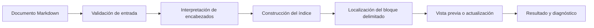

# Día 05 — Generador de índice Markdown

> Proyecto del reto **30 Días, 30 Proyectos**. Las seis fases de la v1 están completadas: contrato, referencias sintéticas, núcleo de interpretación, actualización protegida, CLI y cierre de calidad con guía y demostración local.

## Propósito

Crear una utilidad local de línea de comandos que lea un documento Markdown, identifique su estructura de encabezados y mantenga un índice jerárquico navegable dentro de un bloque delimitado del mismo documento. El objetivo es reducir el mantenimiento manual del índice sin alterar el resto del contenido.

## Alcance de la primera versión

La primera versión estará orientada a un único archivo Markdown por ejecución y utilizará exclusivamente recursos locales.

Funcionalidades previstas:

- Leer un documento Markdown UTF-8 indicado de forma explícita.
- Detectar encabezados ATX válidos y conservar su orden y nivel jerárquico.
- Excluir del índice los encabezados ubicados dentro de bloques de código delimitados.
- Generar enlaces internos con anclas deterministas y coherentes con el contrato documentado.
- Construir una lista jerárquica según el nivel de los encabezados seleccionados.
- Sustituir exclusivamente el contenido entre los delimitadores de índice acordados.
- Informar de forma accionable los errores de ruta, codificación, marcadores ausentes, marcadores duplicados o estructura Markdown no procesable.
- Ofrecer una operación de vista previa para revisar el resultado antes de modificar el documento.

## Límites explícitos

La primera versión no incluirá:

- Procesamiento masivo de directorios ni lectura recursiva.
- Edición de archivos distintos del documento indicado.
- Soporte de HTML embebido, extensiones particulares de plataformas o sintaxis Markdown no definida en el contrato v1.
- Detección y reparación automática de enlaces rotos.
- Interfaz web, integración cloud, telemetría, base de datos o dependencias externas.
- Cambios fuera del bloque de índice delimitado.

## Arquitectura conceptual

La organización separará la interpretación del documento, la construcción del índice y la actualización segura del contenido. La coordinación de la interfaz de línea de comandos quedará aislada de las reglas de transformación.

| Área | Archivo reservado | Responsabilidad futura |
|---|---|---|
| Interfaz y coordinación | [`src/main.py`](src/main.py) | Validar la solicitud, coordinar el flujo y comunicar el resultado. |
| Lectura e interpretación | [`src/parser.py`](src/parser.py) | Identificar encabezados elegibles, bloques excluidos y diagnósticos. |
| Construcción del índice | [`src/toc.py`](src/toc.py) | Transformar la estructura detectada en un índice jerárquico y sus anclas. |
| Actualización protegida | [`src/rewriter.py`](src/rewriter.py) | Localizar el bloque delimitado y preparar una actualización que preserve el resto del documento. |
| Verificación | [`tests`](tests) | Comprobar contratos unitarios, preservación del contenido e integración de la interfaz. |



## Flujo general de trabajo

1. La persona usuaria indica el documento Markdown y el modo de operación solicitado.
2. La herramienta valida accesibilidad, tipo de entrada y condiciones de seguridad definidas por el contrato.
3. El intérprete identifica encabezados elegibles y omite las regiones excluidas.
4. El generador produce un índice jerárquico con enlaces internos estables.
5. El actualizador encuentra un único bloque delimitado de índice.
6. En vista previa se presenta el cambio propuesto sin persistirlo; en actualización se reemplaza únicamente el contenido del bloque.
7. La interfaz comunica el resultado, los diagnósticos y el estado de la operación.

## Requisitos previstos

- Python 3.11 o superior.
- Sistema de archivos local con permisos de lectura para la vista previa y permisos de escritura únicamente cuando se solicite actualizar.
- Documentos Markdown en codificación UTF-8.
- Biblioteca estándar de Python como única base prevista para la v1.

No se prevén secretos, variables de entorno, servicios externos ni archivos de configuración ejecutable.

## Estrategia de desarrollo

El desarrollo seguirá una secuencia guiada por contrato y pruebas:

1. Cerrar el contrato de sintaxis, delimitadores, reglas de anclas, seguridad y CLI.
2. Preparar fixtures sintéticos y resultados de referencia antes de implementar la lógica.
3. Implementar cada área aislada y validar sus casos límite.
4. Integrar la interfaz de línea de comandos sobre componentes ya verificados.
5. Completar pruebas de no regresión, documentación de uso y demostración local.

La fuente de planificación y criterios de aceptación es [`ROADMAP.md`](ROADMAP.md). El contrato v1 aprobado se encuentra en [`docs/CONTRATO.md`](docs/CONTRATO.md); las fases posteriores deberán implementarlo sin ampliar el alcance de forma implícita.

## Estructura esperada

```text
projects/day-05-markdown-toc/
├── assets/                 Recurso de demostración sintético
├── data/
│   ├── expected/           Resultados de referencia de Fase 2
│   └── fixtures/           Documentos sintéticos de Fase 2
├── docs/                   Contrato, decisiones e inventario de escenarios
├── examples/               Guía de uso reproducible sin datos externos
├── src/
│   ├── main.py             Interfaz de línea de comandos
│   ├── parser.py           Interpretación de Markdown
│   ├── rewriter.py         Actualización delimitada
│   └── toc.py              Generación del índice
├── tests/
│   ├── test_cli.py         Pruebas de integración
│   ├── test_parser.py      Pruebas de interpretación
│   ├── test_quality_regression.py  Regresión de ejecución pública
│   ├── test_rewriter.py    Pruebas de actualización
│   └── test_toc.py         Pruebas de generación
├── README.md               Documentación inicial
└── ROADMAP.md              Plan de desarrollo y aceptación
```

Los módulos [`src/parser.py`](src/parser.py) y [`src/toc.py`](src/toc.py) contienen el núcleo puro de Fase 3. [`src/rewriter.py`](src/rewriter.py) incorpora la vista previa y actualización protegida de Fase 4. [`src/main.py`](src/main.py) integra la CLI y conserva literalmente los saltos de línea de una vista previa cuando se ejecuta como proceso. La verificación final se documenta en [`docs/VERIFICACION_FASE_6.md`](docs/VERIFICACION_FASE_6.md); [`examples/USO.md`](examples/USO.md) y [`assets/demo-document.md`](assets/demo-document.md) permiten reproducir el uso local.

## Convenciones de organización

- Mantener una responsabilidad principal por módulo futuro.
- Conservar los documentos de prueba sintéticos y libres de datos sensibles.
- Separar fixtures de entrada y resultados de referencia en [`data/fixtures`](data/fixtures) y [`data/expected`](data/expected).
- Registrar decisiones de alcance y contrato en [`docs`](docs) antes de introducir cambios de comportamiento.
- Asegurar que el formato de salida sea determinista para poder verificarlo de forma reproducible.
- Preservar de forma estricta el contenido situado fuera del bloque delimitado de índice.
- No incorporar dependencias ni configuración ejecutable salvo que una fase posterior las justifique y documente.

## Fases del roadmap

| Fase | Objetivo | Dependencia | Entregable principal |
|---|---|---|---|
| 0 | Planificar y reservar la estructura sin implementación. | Ninguna | Este README, [`ROADMAP.md`](ROADMAP.md) y archivos Python vacíos. |
| 1 | Cerrar el contrato de sintaxis, delimitadores, anclas, operaciones y errores. | Fase 0 | [`docs/CONTRATO.md`](docs/CONTRATO.md), completado. |
| 2 | Diseñar fixtures y resultados de referencia. | Fase 1 | Datos sintéticos en [`data`](data) e inventario en [`docs/ESCENARIOS.md`](docs/ESCENARIOS.md), completado. |
| 3 | Construir y verificar interpretación y generación del índice. | Fase 2 | [`src/parser.py`](src/parser.py), [`src/toc.py`](src/toc.py), pruebas unitarias y [`docs/VERIFICACION_FASE_3.md`](docs/VERIFICACION_FASE_3.md), completado. |
| 4 | Construir y verificar la actualización segura y la vista previa. | Fase 3 | [`src/rewriter.py`](src/rewriter.py), pruebas de preservación y [`docs/VERIFICACION_FASE_4.md`](docs/VERIFICACION_FASE_4.md), completado. |
| 5 | Integrar la interfaz de línea de comandos y los diagnósticos. | Fases 3 y 4 | [`src/main.py`](src/main.py), pruebas de integración y [`docs/VERIFICACION_FASE_5.md`](docs/VERIFICACION_FASE_5.md), completado. |
| 6 | Cerrar calidad, documentación operativa y demostración. | Fase 5 | Suite completa, guía y recurso de demo, completado. |

Los detalles, tareas, criterios de aceptación y evolución futura se encuentran en [`ROADMAP.md`](ROADMAP.md).

## Uso local

Desde [`projects/day-05-markdown-toc`](.):

```text
python src/main.py <DOCUMENT_PATH>
python src/main.py <DOCUMENT_PATH> --write
```

- Sin [`--write`](src/main.py:29), se imprime el documento propuesto completo en salida estándar y el archivo no se modifica.
- Con [`--write`](src/main.py:29), se realiza la actualización delimitada y se imprime `Índice actualizado.`.
- Los argumentos inválidos devuelven código `2`. Los errores de entrada, UTF-8, delimitadores o actualización se emiten por salida de error y devuelven código `1`; las operaciones correctas devuelven `0`.

## Verificación y demostración

La guía reproducible está en [`examples/USO.md`](examples/USO.md). El recurso sintético [`assets/demo-document.md`](assets/demo-document.md) contiene un bloque válido y puede revisarse sin modificarlo:

```text
python src/main.py assets/demo-document.md
```

La ejecución pública preserva los saltos de línea de la vista previa, incluido CRLF, y la actualización solo se solicita con [`--write`](src/main.py:29). La cobertura final incorpora rutas relativas y absolutas, UTF-8 con BOM, Unicode, CRLF e idempotencia en [`tests/test_quality_regression.py`](tests/test_quality_regression.py).

## Estado final

La v1 está completada y no requiere credenciales, conexión de red, servicios de terceros ni dependencias externas. Sus límites permanecen deliberados: procesa un archivo local por operación, solo encabezados ATX fuera de bloques de código delimitados, no crea delimitadores y no admite lotes, enlaces simbólicos, Setext ni perfiles de anclas de plataformas.

## Evolución futura propuesta

- Soporte configurable para niveles de encabezado, exclusiones y estilos de índice.
- Detección de sintaxis Markdown adicional y compatibilidad por plataforma.
- Procesamiento por lotes con vista previa consolidada.
- Comprobación de enlaces internos y reporte de anclas duplicadas.
- Copias de seguridad, modo transaccional y salida de diferencias legibles.
- Integración como gancho de control de versiones o automatización documental.
- Exportación de índices a otros formatos y documentación de accesibilidad.
