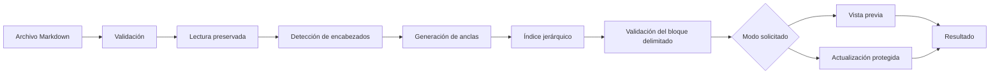
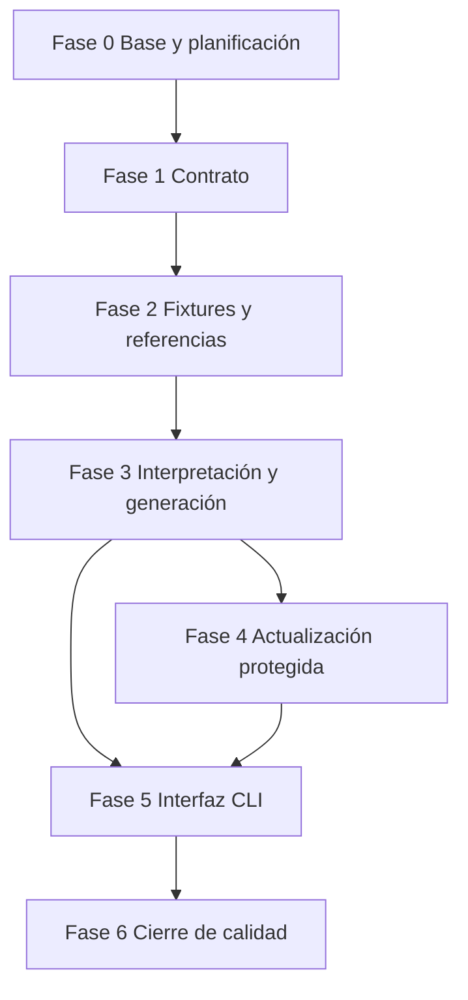

# Roadmap — Generador de índice Markdown

## Objetivo de la primera versión

Construir una utilidad local de línea de comandos en Python 3.11+ que lea un único documento Markdown UTF-8, obtenga un índice jerárquico a partir de encabezados ATX elegibles y sustituya únicamente el contenido de un bloque de índice delimitado. La solución deberá permitir una vista previa sin persistencia, actualizar el archivo solo mediante una acción explícita y funcionar con la biblioteca estándar, fixtures locales y sin servicios externos.

## Decisiones y límites iniciales

- La herramienta procesa un solo archivo por operación.
- La entrada debe ser un archivo Markdown legible en UTF-8; la política exacta para extensiones, saltos de línea y codificaciones alternativas se cerrará en la fase de contrato.
- La versión inicial reconocerá encabezados ATX y excluirá los que estén dentro de bloques de código delimitados. Los encabezados Setext, HTML u otras extensiones quedan fuera de alcance hasta una evolución posterior.
- El índice reflejará una jerarquía basada en los niveles de encabezado incluidos por el contrato v1.
- Las anclas se derivarán de los textos de encabezado mediante reglas deterministas documentadas. La resolución de caracteres Unicode, puntuación, entidades, duplicados y coincidencia con plataformas se fijará antes de implementar.
- El documento debe contener exactamente un par válido de delimitadores de índice. La herramienta no creará delimitadores, no adivinará ubicaciones y no modificará el documento si el bloque no es válido.
- La operación de vista previa nunca escribe el archivo. La actualización solo reemplaza el contenido interior del bloque delimitado y conserva todo lo exterior byte a byte en la medida permitida por el contrato de codificación y saltos de línea.
- Los errores previsibles deben ser claros y no dejar actualizaciones parciales. La estrategia de escritura segura se definirá y verificará en las fases de actualización e integración.
- La primera versión no procesa directorios, no sincroniza varios archivos, no inspecciona enlaces externos y no requiere dependencias externas.

## Flujo de procesamiento previsto

1. La interfaz recibe la ruta y el modo de operación.
2. La validación confirma que la entrada puede procesarse sin riesgo de sobrescribir un recurso no admitido.
3. La lectura conserva la información necesaria para preservar la representación del documento según el contrato.
4. El intérprete identifica encabezados ATX elegibles, omitiendo las áreas excluidas.
5. El generador asigna anclas deterministas y organiza el índice de forma jerárquica.
6. El actualizador verifica que existe un único bloque delimitado válido.
7. En vista previa se comunica el contenido propuesto; en actualización se persiste el reemplazo limitado al bloque.
8. La interfaz entrega un resultado comprensible y un estado consistente.

## Dependencias entre fases

## Arquitectura y responsabilidades futuras

| Componente | Archivo o directorio reservado | Responsabilidad futura | Dependencia principal |
|---|---|---|---|
| Interfaz CLI | [`src/main.py`](src/main.py) | Validar la solicitud, seleccionar vista previa o actualización, coordinar el flujo y comunicar resultados. | Interpretación, índice y actualización. |
| Intérprete Markdown | [`src/parser.py`](src/parser.py) | Detectar encabezados admitidos y regiones excluidas, conservando metadatos y diagnósticos. | Contrato de sintaxis. |
| Generador de índice | [`src/toc.py`](src/toc.py) | Normalizar anclas, resolver duplicados y representar la jerarquía de enlaces. | Encabezados normalizados y contrato de anclas. |
| Actualizador | [`src/rewriter.py`](src/rewriter.py) | Verificar delimitadores, preparar la modificación limitada y preservar el contenido externo. | Índice generado y contrato de actualización. |
| Pruebas | [`tests`](tests) | Validar componentes aislados, preservación, flujo CLI y regresión. | Fixtures y resultados de referencia. |
| Entradas sintéticas | [`data/fixtures`](data/fixtures) | Representar casos de aceptación y errores sin datos sensibles. | Contrato v1. |
| Referencias | [`data/expected`](data/expected) | Fijar resultados verificables de índice, vista previa y documento actualizado. | Fixtures y reglas deterministas. |
| Contrato y decisiones | [`docs`](docs) | Registrar sintaxis, delimitadores, errores, decisiones y límites. | Planificación. |

La separación interpretación → generación → actualización evita que la interfaz o la persistencia definan reglas de Markdown. Permitirá ampliar formatos de entrada o estrategias de salida sin cambiar el núcleo de estructuración.

## Fases de trabajo

### Fase 0 — Base estructural y planificación

**Estado:** completada.

**Objetivo:** reservar un espacio aislado para el Día 05 y documentar el alcance sin introducir implementación, configuración ejecutable ni dependencias.

**Tareas:**

- Crear los directorios de código, pruebas, fixtures, resultados esperados, documentación, ejemplos y recursos.
- Reservar módulos y archivos de prueba completamente vacíos.
- Documentar propósito, límites, arquitectura conceptual, flujo, convenciones y evolución en [`README.md`](README.md).
- Elaborar este roadmap con fases, dependencias y criterios de aceptación.

**Entregables:** estructura en [`projects/day-05-markdown-toc`](.), [`README.md`](README.md), [`ROADMAP.md`](ROADMAP.md) y archivos Python vacíos.

**Criterios de aceptación:**

- No existe lógica, código ejecutable, dependencia, configuración operativa ni fixture con contenido.
- Cada archivo reservado tiene una responsabilidad futura descrita en la documentación.
- README y roadmap usan la misma definición de alcance v1.

### Fase 1 — Contrato funcional y de seguridad

**Estado:** completada.

**Objetivo:** eliminar ambigüedades antes de implementar o crear datos de prueba.

**Dependencia:** Fase 0 completada.

**Tareas:**

- Definir la gramática v1 de encabezados ATX y los niveles admitidos.
- Precisar qué regiones quedan excluidas, incluidos bloques de código delimitados y el tratamiento de casos ambiguos.
- Fijar los delimitadores literales del bloque de índice, su cardinalidad, posición admisible y los diagnósticos de bloque ausente, incompleto, invertido o duplicado.
- Establecer las reglas deterministas de normalización de anclas, Unicode, puntuación, espacios y encabezados repetidos.
- Especificar la estructura de la lista jerárquica y la política para saltos de nivel.
- Definir modos CLI, condiciones de lectura y escritura, vista previa, confirmación de actualización, salida y códigos de retorno.
- Decidir la estrategia de preservación de saltos de línea, final de archivo y escritura segura.

**Entregables:** [`docs/CONTRATO.md`](docs/CONTRATO.md), registro de decisiones en [`docs`](docs) y actualización de límites en [`README.md`](README.md) si procede.

**Resultado:** el contrato v1 quedó publicado en [`docs/CONTRATO.md`](docs/CONTRATO.md). Define la gramática ATX admisible, exclusión de bloques de código delimitados, reglas deterministas de anclas y jerarquía, delimitadores literales, preservación, seguridad de rutas, modos CLI y códigos de salida. Esta fase no introduce código, fixtures, dependencias ni configuración ejecutable.

**Criterios de aceptación:**

- Cada entrada admisible, excluida o inválida tiene un comportamiento y diagnóstico documentados.
- Las reglas de anclas permiten resolver resultados repetidos sin ambigüedad.
- La operación de actualización no puede modificar contenido fuera del bloque delimitado por definición.
- No se introduce implementación funcional.

### Fase 2 — Fixtures y resultados de referencia

**Estado:** completada.

**Objetivo:** convertir el contrato v1 en escenarios reproducibles antes de escribir lógica.

**Dependencia:** Fase 1 aprobada.

**Tareas:**

- Diseñar documentos mínimos, profundos y realistas con jerarquías de encabezados válidas.
- Incluir encabezados repetidos, Unicode, puntuación, espacios, enlaces o énfasis en títulos si el contrato los admite.
- Incluir bloques de código que contengan texto similar a encabezados para verificar su exclusión.
- Preparar casos sin delimitadores, con delimitadores mal formados, duplicados, invertidos o con contenido previo obsoleto.
- Añadir escenarios de archivo vacío, sin encabezados, sin permisos, codificación no admitida y rutas inválidas según el entorno de pruebas disponible.
- Registrar índices, vistas previas y documentos actualizados esperados de forma determinista.
- Inventariar los escenarios y la cobertura prevista en documentación.

**Entregables:** entradas en [`data/fixtures`](data/fixtures), referencias en [`data/expected`](data/expected) e inventario documentado en [`docs/ESCENARIOS.md`](docs/ESCENARIOS.md).

**Resultado:** se publicaron fixtures sintéticos para jerarquías válidas, casos límite ATX, código delimitado sin cierre, ausencia de encabezados, documento vacío y todos los estados de delimitadores. Las referencias fijan encabezados, anclas, profundidades, índices, vistas previas y diagnósticos; [`docs/ESCENARIOS.md`](docs/ESCENARIOS.md) documenta su trazabilidad y la cobertura de sistema de archivos prevista. Esta fase no introduce lógica funcional, pruebas ejecutables, dependencias ni configuración operativa.

**Criterios de aceptación:**

- Todos los criterios de aceptación del contrato tienen al menos un escenario representativo.
- Las referencias permiten detectar cambios en jerarquía, anclas, delimitadores y contenido preservado.
- Los datos son sintéticos y no contienen información sensible.
- No se introduce implementación funcional antes de que los casos sean revisados.

### Fase 3 — Interpretación de Markdown y generación de índice

**Estado:** completada.

**Objetivo:** construir un núcleo verificable que extraiga estructura y produzca un índice determinista sin escribir archivos.

**Dependencia:** Fase 2 completada.

**Tareas:**

- Implementar la representación interna necesaria para encabezados, posiciones, diagnósticos y estructura de índice.
- Implementar la detección de encabezados ATX y la exclusión de regiones definidas por el contrato.
- Implementar la normalización de anclas y la resolución de duplicados.
- Implementar la composición jerárquica ante niveles consecutivos y saltos de nivel según la política acordada.
- Crear pruebas unitarias para interpretación, anclas y presentación determinista del índice.

**Entregables:** contenido funcional en [`src/parser.py`](src/parser.py) y [`src/toc.py`](src/toc.py), junto con pruebas en [`tests/test_parser.py`](tests/test_parser.py) y [`tests/test_toc.py`](tests/test_toc.py).

**Resultado:** se implementó un núcleo puro que extrae encabezados ATX elegibles, excluye fences conforme al contrato, normaliza anclas, resuelve duplicados y renderiza la jerarquía determinista sin leer ni escribir archivos. Las pruebas usan las referencias de Fase 2 y la ejecución queda registrada en [`docs/VERIFICACION_FASE_3.md`](docs/VERIFICACION_FASE_3.md). La validación de delimitadores, preservación, persistencia, rutas, permisos, codificación y CLI permanece explícitamente en las fases 4 y 5.

**Criterios de aceptación:**

- Los fixtures válidos producen encabezados, orden, niveles y anclas esperados.
- Las regiones excluidas no generan entradas de índice.
- Los casos repetidos y Unicode se resuelven conforme al contrato.
- El resultado del índice es estable ante ejecuciones repetidas del mismo documento.
- Esta fase no modifica archivos de entrada.

### Fase 4 — Actualización limitada y vista previa

**Estado:** completada.

**Objetivo:** incorporar la sustitución protegida del bloque de índice sin afectar el contenido ajeno.

**Dependencia:** Fase 3 completada y contrato de preservación cerrado.

**Tareas:**

- Implementar la localización y validación estricta del único bloque delimitado.
- Implementar la construcción del documento propuesto con sustitución limitada al contenido interior.
- Implementar el modo de vista previa sin persistencia.
- Implementar la estrategia acordada de escritura segura, manejo de errores y recuperación ante fallo previsible.
- Crear pruebas de preservación integral del contenido exterior, delimitadores erróneos y repetición de actualización.

**Entregables:** contenido funcional en [`src/rewriter.py`](src/rewriter.py) y pruebas en [`tests/test_rewriter.py`](tests/test_rewriter.py).

**Resultado:** se implementó la validación literal de un único bloque delimitado, la construcción pura de vista previa y la actualización atómica del archivo seleccionado. La sustitución conserva el contenido exterior, BOM UTF-8, finales de línea y la presencia o ausencia de salto final; la persistencia evita escrituras idénticas y limpia el temporal si falla. Las pruebas de preservación, idempotencia, errores de bloque, codificación, permisos y fallo de escritura se registran en [`docs/VERIFICACION_FASE_4.md`](docs/VERIFICACION_FASE_4.md). La CLI, sus códigos de salida y su presentación de diagnósticos siguen asignados a la Fase 5.

**Criterios de aceptación:**

- Un documento actualizado conserva sin cambios el contenido situado antes y después del bloque delimitado.
- La vista previa no altera el archivo en ningún escenario.
- Un bloque ausente, duplicado, incompleto, invertido o no válido produce un diagnóstico y no escribe cambios.
- Repetir la actualización sin cambios de encabezados produce un resultado equivalente y no duplica el índice.
- No quedan archivos temporales ni actualizaciones parciales tras un error manejable.

### Fase 5 — Interfaz de línea de comandos e integración

**Estado:** completada.

**Objetivo:** exponer el flujo completo con una interacción explícita, segura y comprensible.

**Dependencias:** Fases 3 y 4 completadas.

**Tareas:**

- Implementar el punto de entrada y los argumentos definidos en el contrato.
- Validar ruta, tipo de recurso, permisos y modo seleccionado antes de procesar.
- Conectar interpretación, generación, vista previa y actualización sin duplicar reglas de negocio.
- Producir mensajes claros, salida estable y códigos de retorno documentados.
- Crear pruebas de integración basadas en fixtures para casos exitosos y de error.

**Entregables:** contenido funcional en [`src/main.py`](src/main.py) y pruebas en [`tests/test_cli.py`](tests/test_cli.py).

**Resultado:** se integró la CLI local `python src/main.py <DOCUMENT_PATH> [--write]` sin duplicar las reglas del núcleo ni del actualizador. La vista previa escribe el documento propuesto en salida estándar sin persistirlo; `--write` realiza la actualización protegida y comunica `Índice actualizado.`. Las rutas, extensiones, enlaces simbólicos, permisos de lectura, UTF-8, delimitadores, errores de actualización y argumentos inválidos producen diagnósticos deterministas por salida de error con los códigos documentados. Las verificaciones de integración usan copias temporales y se registran en [`docs/VERIFICACION_FASE_5.md`](docs/VERIFICACION_FASE_5.md).

**Criterios de aceptación:**

- La vista previa y la actualización siguen exactamente el contrato desde una terminal local.
- Los errores comunes informan la causa, no exponen trazas internas y no alteran documentos.
- La actualización correcta coincide con los resultados de referencia.
- La integración no añade dependencias externas.

### Fase 6 — Cierre de calidad, documentación y demo

**Estado:** completada.

**Objetivo:** entregar una versión verificable, reproducible y comprensible desde una copia limpia del repositorio.

**Dependencia:** Fase 5 completada.

**Tareas:**

- Ejecutar y completar pruebas unitarias, integración y regresión con todos los fixtures.
- Revisar comportamiento con Unicode, saltos de línea, archivos sin encabezados y errores de lectura o escritura.
- Documentar requisitos, instalación, uso, modos, límites, errores y recuperación sin incluir información sensible.
- Preparar una guía de uso en [`examples`](examples) y un recurso de demo sintético en [`assets`](assets).
- Verificar que roadmap, contrato, ejemplos y comportamiento real son coherentes.

**Entregables:** suite de pruebas completa, README operativo actualizado, guía reproducible, documentación de contrato final y recurso de demostración local.

**Resultado:** se añadió la regresión de ejecución pública con rutas relativas y absolutas, UTF-8 con BOM, Unicode, CRLF e idempotencia en [`tests/test_quality_regression.py`](tests/test_quality_regression.py). La CLI conserva literalmente los saltos de línea de una vista previa ejecutada como proceso. [`examples/USO.md`](examples/USO.md) documenta instalación, modos, errores y recuperación; [`assets/demo-document.md`](assets/demo-document.md) permite una demostración sintética local. La verificación final queda registrada en [`docs/VERIFICACION_FASE_6.md`](docs/VERIFICACION_FASE_6.md). La v1 mantiene sus límites declarados y no incorpora dependencias, credenciales, red ni servicios externos.

**Criterios de aceptación:**

- Una persona puede verificar la herramienta con recursos locales y documentación suficiente.
- La suite cubre flujo principal, delimitadores inválidos, preservación, vista previa, duplicados, Unicode y diagnósticos principales.
- La documentación declara con precisión lo que la herramienta hace y no hace.
- No se requieren credenciales, conexión de red ni servicios de terceros.

## Estrategia de pruebas

- **Interpretación:** encabezados ATX válidos e inválidos, niveles, espacios, texto vacío, bloques de código y orden físico.
- **Anclas e índice:** Unicode, puntuación, símbolos, títulos repetidos, niveles discontinuos y orden determinista.
- **Actualización:** bloque válido, marcadores faltantes, duplicados, invertidos, contenido obsoleto, preservación de secciones externas e idempotencia.
- **CLI:** argumentos, rutas inválidas, directorios, permisos, codificación no admitida, vista previa, actualización y códigos de retorno.
- **Regresión:** comparación de índices y documentos actualizados contra referencias de [`data/expected`](data/expected).
- **No funcionales básicos:** documentos de tamaño representativo, estabilidad de salida, ausencia de modificaciones parciales y conservación de contenido no relacionado.

## Riesgos y mitigaciones

| Riesgo | Mitigación prevista |
|---|---|
| Diferencias entre anclas de plataformas Markdown | Declarar una única política v1 determinista y documentar las incompatibilidades conocidas. |
| Markdown con sintaxis ambigua o extensiones | Limitar la primera versión a la gramática acordada y reportar o ignorar explícitamente lo no admitido. |
| Sobrescritura accidental del documento | Exigir una acción explícita de actualización, incorporar vista previa y limitar el reemplazo al bloque delimitado. |
| Marcadores inconsistentes | Validar cardinalidad, orden y forma antes de producir cualquier escritura. |
| Pérdida de formato exterior | Definir pruebas de preservación y estrategia de escritura segura antes de integrar la CLI. |
| Encabezados en bloques de código | Mantener estado de regiones excluidas y cubrirlo mediante fixtures. |
| Resultados difíciles de probar | Usar reglas de anclas, jerarquía y referencias de salida completamente deterministas. |
| Crecimiento no controlado del alcance | Mantener las extensiones de plataforma, lotes e integración de control de versiones fuera de la v1. |

## Evolución futura fuera de alcance

- Configuración de niveles incluidos, exclusiones y estilos de lista.
- Soporte de encabezados Setext, HTML embebido y extensiones de Markdown por plataforma.
- Perfiles de anclas compatibles con proveedores concretos.
- Modo de análisis para diagnosticar anclas duplicadas, enlaces internos y bloques de índice obsoletos.
- Procesamiento por lotes de repositorios y reglas de exclusión de rutas.
- Vista de diferencias, copias de seguridad, recuperación transaccional y estrategia de escritura configurable.
- Integración con ganchos de control de versiones, sistemas de documentación continua y editores.
- Salida alternativa en HTML, JSON u otros formatos de navegación.
- Accesibilidad, internacionalización y métricas de calidad documental.

## Orden recomendado de implementación

1. Aprobar y publicar el contrato v1 en [`docs/CONTRATO.md`](docs/CONTRATO.md).
2. Crear fixtures y resultados esperados que cubran todas las reglas acordadas.
3. Implementar y probar interpretación y generación de índice sin operaciones de escritura.
4. Implementar y probar vista previa y actualización delimitada con preservación estricta.
5. Integrar los componentes en la interfaz de línea de comandos.
6. Completar regresión, documentación operativa y demostración local.
