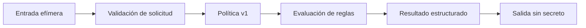

# Día 06 — Validador de políticas de contraseña

> Microproyecto del reto **30 Días, 30 Proyectos**. Las fases 0 a 5 están completadas: estructura, contrato v1, escenarios sintéticos, núcleo puro, CLI local, presentación segura, cierre de calidad y demostración reproducible sin secretos.

## Propósito

Definir una herramienta local de línea de comandos para evaluar una contraseña frente a una política explícita y comunicar, de forma determinista, las reglas satisfechas e incumplidas. El proyecto busca facilitar una comprobación educativa y reproducible sin almacenar, registrar ni transmitir contraseñas.

## Alcance de la primera versión

La v1 se orientará a validar una contraseña introducida para una única evaluación local. Las reglas exactas, el mecanismo de entrada, los mensajes permitidos y los códigos de salida están definidos en [`docs/CONTRATO.md`](docs/CONTRATO.md).

Funcionalidades previstas:

- Recibir una contraseña para una validación local y efímera.
- Evaluar reglas de longitud, letras mayúsculas, letras minúsculas, dígitos y caracteres especiales conforme al contrato v1.
- Informar cada regla aprobada o incumplida sin revelar la contraseña en la salida.
- Comunicar un resultado global determinista y un código de salida adecuado.
- Permitir una demostración reproducible basada exclusivamente en escenarios y resultados sintéticos, sin modo CLI adicional.

## Límites explícitos

La primera versión no incluirá:

- Almacenamiento, registro, telemetría, transmisión por red ni persistencia de contraseñas.
- Verificación contra contraseñas filtradas, diccionarios remotos, APIs de terceros o servicios cloud.
- Generación, recuperación, cifrado, hash, rotación o gestión de credenciales.
- Autenticación, gestión de usuarios, base de datos, interfaz web o integración con sistemas externos.
- Análisis de frases de contraseña, estimación probabilística de entropía o comprobación de reutilización.
- Procesamiento por lotes de archivos, entrada estándar o múltiples políticas no definidas por el contrato v1.

## Seguridad y privacidad previstas

La contraseña es un dato sensible durante la ejecución. El contrato v1 prohíbe imprimirla, incorporarla a excepciones o diagnósticos, guardarla en fixtures, ejemplos, resultados de referencia o recursos de demostración, y depender de conectividad externa. Las entradas sintéticas futuras solo representarán categorías y resultados esperados, nunca contraseñas reales o reutilizables. Consulta las reglas completas en [`docs/CONTRATO.md`](docs/CONTRATO.md).

## Arquitectura conceptual

La organización separará la definición de la política, la evaluación pura de reglas y la presentación de la interfaz. La coordinación de la línea de comandos no deberá contener ni duplicar las reglas de seguridad.

| Área | Archivo | Responsabilidad |
|---|---|---|
| Interfaz y coordinación | [`src/main.py`](src/main.py) | Solicita la entrada sin eco, coordina el núcleo y devuelve códigos seguros. |
| Política | [`src/policy.py`](src/policy.py) | Representa los límites inmutables, reglas y orden contractual de la v1. |
| Evaluación | [`src/validator.py`](src/validator.py) | Evalúa íntegramente la política y produce un resultado estructurado sin retener, persistir ni formatear datos sensibles. |
| Presentación | [`src/reporters.py`](src/reporters.py) | Convierte el resultado secreto-libre en salida estable autorizada por el contrato. |
| Pruebas | [`tests`](tests) | Verifica núcleo, integración de CLI, códigos de salida, orden y no revelación. |



## Flujo general previsto

1. La persona usuaria solicita una única comprobación local mediante la interfaz definida por el contrato.
2. La interfaz valida los argumentos y evita que la contraseña aparezca en salidas accidentales.
3. El componente de política proporciona las reglas vigentes de la v1.
4. El validador evalúa cada regla de manera determinista y genera un resultado estructurado.
5. El presentador comunica el estado global y las reglas aplicables, sin reproducir el valor evaluado.
6. La interfaz finaliza con el código de salida documentado.

## Requisitos previstos

- Python 3.11 o superior.
- Biblioteca estándar de Python como única base prevista para la v1.
- Ejecución local sin red, credenciales, variables de entorno ni servicios externos.

No se prevén dependencias de terceros, secretos ni configuración ejecutable. Por ello, no se reserva [`requirements.txt`](requirements.txt) ni [`.env.example`](.env.example) en esta Fase 0.

## Estrategia de desarrollo

El desarrollo seguirá una secuencia guiada por contrato, seguridad y pruebas:

1. Cerrar las reglas, los límites y los requisitos de privacidad en el contrato v1.
2. Definir casos sintéticos y resultados de referencia que no contengan secretos.
3. Implementar y probar la política y la evaluación como núcleo puro.
4. Integrar la interfaz de línea de comandos y sus diagnósticos seguros.
5. Completar pruebas de regresión, documentación de uso y demostración sin datos sensibles.

La fuente de planificación, tareas y criterios de aceptación es [`ROADMAP.md`](ROADMAP.md). El contrato v1 aprobado está en [`docs/CONTRATO.md`](docs/CONTRATO.md); las fases posteriores deberán implementarlo sin ampliar el alcance de forma implícita.

## Estructura inicial

```text
projects/day-06-password-policy-checker/
├── assets/                 Landing y recursos de demostración locales, sin secretos
├── data/
│   ├── expected/           Resultados de referencia sintéticos futuros
│   └── fixtures/           Escenarios sintéticos futuros, sin contraseñas reales
├── docs/                   Contrato, uso seguro y documentación de la web
├── examples/               Guía de uso reproducible
├── src/
│   ├── main.py             Interfaz de línea de comandos futura
│   ├── policy.py           Definición de política futura
│   ├── reporters.py        Presentación segura futura
│   └── validator.py        Evaluación de reglas futura
├── tests/
│   ├── test_cli.py         Pruebas de integración futuras
│   └── test_validator.py   Pruebas unitarias futuras
├── README.md               Documentación inicial
└── ROADMAP.md              Plan de desarrollo y aceptación
```

La Fase 3 añadió el núcleo puro en [`src/policy.py`](src/policy.py) y [`src/validator.py`](src/validator.py). La Fase 4 añadió la CLI en [`src/main.py`](src/main.py), el formato seguro en [`src/reporters.py`](src/reporters.py) y las pruebas de integración en [`tests/test_cli.py`](tests/test_cli.py). La presentación educativa local está en [`assets/demo-interactiva.html`](assets/demo-interactiva.html), con instrucciones en [`docs/WEB.md`](docs/WEB.md). Consulta la ejecución y sus límites en [`docs/USO_SEGURO.md`](docs/USO_SEGURO.md). Los valores de prueba se generan de forma efímera en memoria; los recursos versionados solo contienen metadatos y resultados abstractos.

## Convenciones de organización

- Mantener una responsabilidad principal por módulo futuro.
- Aislar la evaluación de reglas de la CLI y de la presentación.
- No escribir contraseñas ni equivalentes reversibles en datos versionados, salidas, documentación o recursos de demo.
- Separar entradas sintéticas y referencias en [`data/fixtures`](data/fixtures) y [`data/expected`](data/expected).
- Registrar decisiones de alcance, política y privacidad en [`docs`](docs) antes de implementar cambios de comportamiento.
- Mantener resultados y diagnósticos deterministas para permitir comprobaciones reproducibles.
- No incorporar dependencias, configuración ejecutable ni integraciones externas sin una justificación explícita en una fase posterior.

## Fases del roadmap

| Fase | Objetivo | Dependencia | Entregable principal |
|---|---|---|---|
| 0 | Planificar y reservar la estructura sin implementación. | Ninguna | Este [`README.md`](README.md), [`ROADMAP.md`](ROADMAP.md) y archivos Python vacíos. |
| 1 | Cerrar el contrato de política, CLI, privacidad y errores. | Fase 0 | [`docs/CONTRATO.md`](docs/CONTRATO.md), completado. |
| 2 | Diseñar fixtures sintéticos y resultados de referencia. | Fase 1 | [`data/fixtures/scenario-catalog.json`](data/fixtures/scenario-catalog.json), [`data/expected/scenario-results.json`](data/expected/scenario-results.json) e [`docs/ESCENARIOS_FASE_2.md`](docs/ESCENARIOS_FASE_2.md), completado. |
| 3 | Construir y verificar la política y la evaluación pura. | Contrato v1; escenarios efímeros | [`src/policy.py`](src/policy.py), [`src/validator.py`](src/validator.py) y [`tests/test_validator.py`](tests/test_validator.py), completado. |
| 4 | Integrar la CLI y la presentación segura. | Fase 3 | [`src/main.py`](src/main.py), [`src/reporters.py`](src/reporters.py), [`tests/test_cli.py`](tests/test_cli.py) y [`docs/USO_SEGURO.md`](docs/USO_SEGURO.md), completado. |
| 5 | Cerrar calidad, guía de uso y demostración local segura. | Fase 4 | [`tests/test_quality_regression.py`](tests/test_quality_regression.py), [`examples/USO.md`](examples/USO.md) y documentación operativa, completado. |

Los detalles, tareas, riesgos y evolución propuesta se encuentran en [`ROADMAP.md`](ROADMAP.md).

## Estado actual

Las fases 0 a 5 entregan una herramienta local funcional y verificable sin dependencias externas. La CLI solo acepta `python src/main.py check`, solicita una entrada sin eco, reutiliza el núcleo puro y comunica exclusivamente el estado y los mensajes autorizados. La regresión comprueba cada escenario sintético, límites, Unicode, errores de CLI, orden de salida, coherencia de referencias y ausencia de exposición en los recursos de demostración.

La guía operativa reproducible está en [`examples/USO.md`](examples/USO.md), los límites de ejecución segura están en [`docs/USO_SEGURO.md`](docs/USO_SEGURO.md) y la landing educativa local se documenta en [`docs/WEB.md`](docs/WEB.md). No hay modos alternativos de CLI, configuración, entrada por archivo o [`stdin`](src/main.py:35), persistencia ni red. Las capacidades de fortaleza, filtraciones, generación, autenticación e integraciones externas siguen fuera de alcance.
