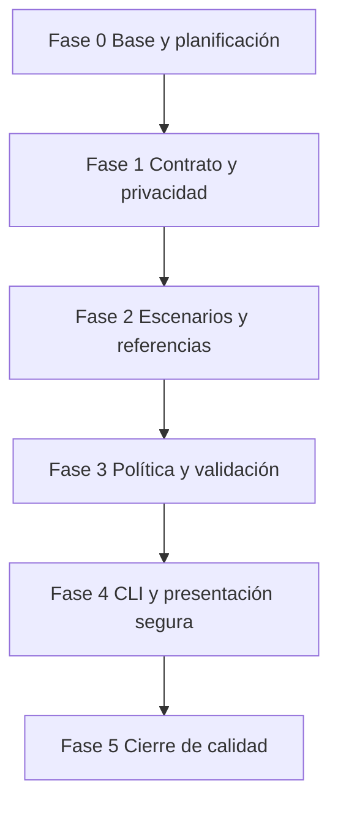

# Roadmap — Validador de políticas de contraseña

## Objetivo de la primera versión

Construir una herramienta CLI local en Python 3.11+ que evalúe una única contraseña de forma efímera frente a una política v1 explícita, informe de manera determinista las reglas satisfechas e incumplidas y no revele, persista, transmita ni incluya la contraseña en salidas o diagnósticos. La solución deberá funcionar sin dependencias externas, credenciales, red ni servicios de terceros, y podrá comprobarse con escenarios sintéticos que no contengan secretos.

## Supuestos y límites iniciales

- Cada ejecución evaluará una única contraseña y una única política v1 fija; la forma segura de proporcionar la entrada se definirá en la Fase 1.
- La política v1 cubrirá como mínimo longitud y presencia de categorías de caracteres, pero sus umbrales, definición de carácter especial y tratamiento de Unicode se cerrarán antes de implementar.
- El resultado diferenciará el estado global de las reglas individuales y tendrá un orden estable.
- La salida, los errores y las excepciones previsibles nunca incluirán la contraseña evaluada ni una representación reversible de esta.
- La herramienta no conservará entradas en archivos, memoria persistente, logs, fixtures, referencias, ejemplos o recursos de demostración.
- La primera versión no comprobará filtraciones, diccionarios, patrones conocidos, reutilización, entropía, hash o fortaleza frente a ataques.
- No habrá integración con red, APIs, proveedores de identidad, base de datos, interfaz web ni configuración con secretos.
- No se procesarán lotes, archivos de contraseñas, entrada estándar ni perfiles de política configurables hasta una evolución posterior.

## Principios de seguridad y privacidad

1. **Minimización de datos:** la contraseña solo existirá durante la evaluación necesaria para producir el resultado.
2. **No revelación:** ninguna salida normal, error, prueba, fixture o demo podrá contener el valor evaluado.
3. **Aislamiento local:** la v1 no realizará conexiones de red ni dependerá de servicios externos.
4. **Diagnósticos seguros:** los mensajes describirán la regla o condición fallida, nunca la entrada sensible.
5. **Datos sintéticos:** los escenarios versionados describirán categorías, longitudes o resultados, sin usar contraseñas reales, reutilizables o secretas.
6. **Determinismo verificable:** las reglas y la salida se documentarán para permitir pruebas sin retener valores sensibles.

## Flujo de procesamiento previsto

1. La interfaz recibe una solicitud de evaluación por el mecanismo seguro definido en el contrato.
2. La CLI valida los argumentos y las condiciones de entrada sin reproducir el dato sensible.
3. El componente de política expone las reglas y umbrales vigentes para la v1.
4. El validador aplica las reglas de forma pura y genera un resultado estructurado.
5. El presentador comunica el estado global y las reglas aplicables sin mostrar la contraseña.
6. La CLI devuelve el código de salida documentado y termina sin persistir la entrada.

## Arquitectura y responsabilidades futuras

| Componente | Archivo o directorio reservado | Responsabilidad futura | Dependencia principal |
|---|---|---|---|
| Interfaz CLI | [`src/main.py`](src/main.py) | Recibir solicitudes, validar argumentos, coordinar componentes y devolver códigos seguros. | Política, validación y presentación. |
| Política | [`src/policy.py`](src/policy.py) | Representar reglas, parámetros y orden de evaluación definidos por el contrato v1. | Contrato de política. |
| Validador | [`src/validator.py`](src/validator.py) | Evaluar reglas sin persistir ni exponer la entrada y producir resultados estructurados. | Política normalizada. |
| Presentación | [`src/reporters.py`](src/reporters.py) | Formatear estados y diagnósticos sin incluir datos sensibles. | Resultado de validación. |
| Pruebas | [`tests`](tests) | Comprobar política, validación, privacidad de la salida e integración de CLI. | Contrato y referencias sintéticas. |
| Escenarios sintéticos | [`data/fixtures`](data/fixtures) | Representar casos mediante categorías y metadatos no sensibles. | Contrato v1. |
| Referencias | [`data/expected`](data/expected) | Fijar resultados y diagnósticos reproducibles sin secretos. | Reglas deterministas. |
| Contrato y escenarios | [`docs`](docs) | Registrar decisiones, criterios de aceptación y límites de privacidad. | Planificación. |

La separación política → validador → presentador evita que la interfaz defina reglas de seguridad o gestione directamente el dato sensible. También permitirá ampliar políticas o formatos de salida sin acoplar cambios al núcleo de evaluación.

## Dependencias entre fases

## Fases de trabajo

### Fase 0 — Base estructural y planificación

**Estado:** completada.

**Objetivo:** crear un espacio aislado para el Día 06, documentar propósito, límites, privacidad, arquitectura y evolución sin introducir lógica funcional, datos, dependencias o configuración ejecutable.

**Tareas:**

- Crear los directorios de código, pruebas, fixtures, referencias, documentación, ejemplos y recursos.
- Reservar módulos y archivos de prueba completamente vacíos.
- Documentar alcance, límites, arquitectura conceptual, flujo, convenciones y principios de seguridad en [`README.md`](README.md).
- Elaborar este roadmap con fases, dependencias, riesgos y criterios de aceptación.

**Entregables:** estructura en [`projects/day-06-password-policy-checker`](.), [`README.md`](README.md), [`ROADMAP.md`](ROADMAP.md) y archivos Python vacíos.

**Criterios de aceptación:**

- No existe lógica, código ejecutable, dependencia, configuración operativa, dato de prueba ni ejemplo con contenido.
- Cada archivo reservado tiene una responsabilidad futura descrita en la documentación.
- README y roadmap comparten la misma definición de alcance y privacidad v1.
- Ningún archivo del proyecto contiene una contraseña real, secreta o reutilizable.

### Fase 1 — Contrato de política, interfaz y privacidad

**Estado:** completada.

**Objetivo:** eliminar ambigüedades de las reglas, la interacción y el tratamiento seguro de la entrada antes de crear fixtures o implementar código.

**Dependencia:** Fase 0 completada.

**Tareas:**

- Definir los umbrales de longitud y las categorías requeridas por la política v1.
- Precisar qué se considera mayúscula, minúscula, dígito y carácter especial, incluido el tratamiento de Unicode, espacios y valores vacíos.
- Definir el orden estable de reglas, el resultado global y los mensajes permitidos.
- Elegir un mecanismo de entrada que reduzca la exposición de la contraseña y documentar sus límites por plataforma.
- Especificar argumentos CLI, modos permitidos, salida estándar, salida de error y códigos de retorno.
- Establecer requisitos de no persistencia, no revelación y manejo de excepciones sin secretos.
- Delimitar los casos fuera de alcance y la política de mensajes para entradas inválidas.

**Entregables:** contrato en [`docs/CONTRATO.md`](docs/CONTRATO.md), decisiones de seguridad y actualización de [`README.md`](README.md).

**Criterios de aceptación:**

- Cada regla, entrada admisible y condición de error tiene un comportamiento documentado.
- El contrato permite determinar resultados sin depender de valores secretos versionados.
- La interfaz y los diagnósticos no requieren imprimir la contraseña.
- No se introduce implementación funcional ni datos de prueba durante la fase.

**Resultado:** se publicó el contrato v1 en [`docs/CONTRATO.md`](docs/CONTRATO.md). Define una política fija de longitud y categorías Unicode, el tratamiento de caracteres combinantes, espacios y entrada vacía, el orden de reglas y el resultado global. También fija el único subcomando `check`, la solicitud local sin eco, los mensajes seguros, los códigos de retorno y la prohibición de canales visibles o persistentes para la contraseña. [`README.md`](README.md) refleja el contrato aprobado y el estado de las fases. No se añadieron dependencias, configuración ejecutable, fixtures, referencias ni código funcional.

### Fase 2 — Escenarios sintéticos y resultados de referencia

**Estado:** completada.

**Objetivo:** convertir el contrato v1 en casos reproducibles, seguros y verificables antes de implementar la lógica.

**Dependencia:** Fase 1 aprobada.

**Tareas:**

- Diseñar escenarios para cada regla satisfecha e incumplida mediante etiquetas, longitudes y categorías no sensibles.
- Incluir combinaciones de incumplimientos, entrada vacía, límites exactos, Unicode y caracteres especiales conforme al contrato.
- Preparar referencias para el estado global, reglas individuales, orden de salida y códigos de retorno.
- Definir una estrategia de pruebas que permita inyectar valores efímeros sin escribirlos en archivos versionados.
- Inventariar la trazabilidad entre reglas, escenarios y resultados esperados.
- Revisar que fixtures, ejemplos, referencias y recursos no revelen ni normalicen contraseñas reutilizables.

**Entregables:** estructura de escenarios en [`data/fixtures`](data/fixtures), referencias en [`data/expected`](data/expected) e inventario en [`docs`](docs).

**Criterios de aceptación:**

- Todas las reglas y errores contractuales tienen al menos un escenario representativo.
- Los datos versionados no contienen contraseñas reales, secretas o recomendables para uso.
- Las referencias permiten detectar cambios en reglas, orden y salida sin exponer datos sensibles.
- No se introduce lógica funcional antes de revisar los casos.

**Resultado:** se publicaron el catálogo declarativo de escenarios en [`data/fixtures/scenario-catalog.json`](data/fixtures/scenario-catalog.json), las referencias estructuradas en [`data/expected/scenario-results.json`](data/expected/scenario-results.json) y el inventario de trazabilidad en [`docs/ESCENARIOS_FASE_2.md`](docs/ESCENARIOS_FASE_2.md). Los recursos describen únicamente condiciones, categorías y estados esperados; los valores de prueba se generan de forma efímera en memoria.

### Fase 3 — Política y evaluación pura

**Estado:** completada.

**Objetivo:** implementar un núcleo verificable que represente la política y evalúe sus reglas sin realizar entrada, salida, persistencia o conexiones externas.

**Dependencia:** Fase 2 completada.

**Tareas:**

- Implementar la representación interna de política, regla y resultado.
- Implementar la evaluación de longitud y categorías según el contrato.
- Garantizar orden determinista de reglas y resultado global.
- Evitar que el núcleo escriba, registre o formatee valores de entrada.
- Crear pruebas unitarias para reglas, límites, Unicode y combinaciones de incumplimientos.

**Entregables:** contenido funcional en [`src/policy.py`](src/policy.py) y [`src/validator.py`](src/validator.py), junto con pruebas en [`tests/test_validator.py`](tests/test_validator.py).

**Criterios de aceptación:**

- Cada escenario sintético produce el resultado estructurado esperado.
- Las reglas se evalúan con el orden y los umbrales definidos por el contrato.
- La evaluación no imprime, persiste ni transmite la entrada.
- La suite verifica que el resultado no contenga la contraseña evaluada.

**Resultado:** [`src/policy.py`](src/policy.py) define una política inmutable con los límites, identificadores, mensajes y orden v1. [`src/validator.py`](src/validator.py) implementa evaluación completa y pura de longitud, categorías Unicode y espacios, y devuelve resultados estructurados sin conservar la entrada. [`tests/test_validator.py`](tests/test_validator.py) cubre reglas individuales y compuestas, límites inclusivos, entrada vacía, tipos no admisibles, Unicode, caracteres combinantes, espacios, determinismo e inspección de ausencia de secretos en el resultado. No se implementaron CLI, presentación, persistencia ni E/S.

### Fase 4 — CLI y presentación segura

**Estado:** completada.

**Objetivo:** exponer el flujo completo mediante una interfaz local que minimice la exposición del dato sensible y comunique resultados claros.

**Dependencia:** Fase 3 completada.

**Tareas:**

- Implementar el punto de entrada y el mecanismo de solicitud definido por el contrato.
- Conectar política, evaluación y presentación sin duplicar reglas de negocio.
- Implementar una presentación estable de reglas y estado global sin revelar la entrada.
- Manejar argumentos inválidos, interrupciones y errores previsibles sin trazas o datos sensibles.
- Crear pruebas de integración de salida, códigos de retorno y ausencia de filtraciones en mensajes.

**Entregables:** contenido funcional en [`src/main.py`](src/main.py) y [`src/reporters.py`](src/reporters.py), con pruebas en [`tests/test_cli.py`](tests/test_cli.py).

**Criterios de aceptación:**

- Una persona puede realizar una comprobación local siguiendo el contrato sin que la salida muestre la contraseña.
- Los errores previsibles son claros, estables y no incluyen el dato evaluado.
- La CLI usa exclusivamente el núcleo validado y no añade dependencias externas.
- Las pruebas de integración confirman la privacidad de los resultados y diagnósticos.

**Resultado:** [`src/main.py`](src/main.py) implementa exclusivamente el subcomando `check`, obtiene la entrada mediante `getpass` y transforma cancelaciones, EOF, avisos de terminal y errores controlables en diagnósticos estáticos sin trazas. [`src/reporters.py`](src/reporters.py) presenta el resultado del núcleo en orden contractual, sin recibir la entrada ni sus propiedades. [`tests/test_cli.py`](tests/test_cli.py) verifica los códigos `0`, `1` y `2`, argumentos inválidos, la integración con el evaluador, el orden de los diagnósticos, cancelaciones, advertencias de lectura sin eco y la ausencia del valor efímero en stdout, stderr y excepciones controladas. La guía [`docs/USO_SEGURO.md`](docs/USO_SEGURO.md) documenta ejecución, canales, códigos y límites. No se añadieron dependencias, opciones, entrada visible, persistencia, red ni lectura de archivos.

### Fase 5 — Cierre de calidad, documentación y demostración segura

**Estado:** completada.

**Objetivo:** entregar una primera versión verificable, reproducible y comprensible desde una copia limpia del repositorio, manteniendo los límites de privacidad declarados.

**Dependencia:** Fase 4 completada.

**Tareas:**

- Ejecutar y completar pruebas unitarias, integración y regresión con todos los escenarios sintéticos.
- Revisar límites de longitud, Unicode, entrada vacía, errores de CLI y ausencia de exposición en todas las salidas.
- Documentar requisitos, instalación, uso seguro, reglas, límites, errores y recuperación sin incluir contraseñas en ejemplos.
- Preparar una guía de uso y una demostración local basada en categorías y resultados sintéticos.
- Verificar la coherencia entre comportamiento, contrato, roadmap, ejemplos y recursos de demo.

**Entregables:** suite completa, README operativo actualizado, guía reproducible y recurso de demostración local seguro.

**Criterios de aceptación:**

- La herramienta puede verificarse localmente sin red, credenciales o servicios de terceros.
- La documentación declara con precisión qué valida y qué queda fuera de alcance.
- No hay contraseñas reales o datos sensibles en archivos versionados, salida esperada o recursos de demostración.
- La suite cubre flujo principal, incumplimientos individuales y combinados, límites, diagnósticos y privacidad de salida.

**Resultado:** se añadió [`tests/test_quality_regression.py`](tests/test_quality_regression.py), que verifica la correspondencia completa entre catálogo y referencias, el orden y los textos de presentación para todos los escenarios sintéticos y la ausencia de marcadores de asignación de secretos en los recursos de escenarios, uso y demostración. La guía operativa y de demostración reproducible se publicó en [`examples/USO.md`](examples/USO.md), mientras que [`README.md`](README.md) y [`docs/USO_SEGURO.md`](docs/USO_SEGURO.md) quedaron alineados con el comportamiento final y sus límites. La suite completa se ejecuta localmente sin red ni dependencias externas.

## Estrategia de pruebas

- **Política:** umbrales, categorías admitidas, orden de reglas y configuración v1 inmutable.
- **Validación:** reglas satisfechas e incumplidas, valores límite, combinaciones, entrada vacía, Unicode, espacios y caracteres especiales conforme al contrato.
- **Privacidad:** ausencia de la entrada en resultados, errores, mensajes, excepciones controladas y recursos versionados.
- **CLI:** argumentos, mecanismo de entrada, salida estable, errores previsibles, interrupciones y códigos de retorno.
- **Regresión:** comparación de resultados estructurados y textos de salida con referencias no sensibles en [`data/expected`](data/expected).
- **No funcionales básicos:** ejecución local sin red, sin escrituras inesperadas y sin dependencias externas.

## Riesgos y mitigaciones

| Riesgo | Mitigación prevista |
|---|---|
| Exposición accidental de la contraseña en terminal, errores o pruebas | Definir un mecanismo de entrada seguro, no interpolar entradas en mensajes y añadir pruebas específicas de no revelación. |
| Ambigüedad sobre clases de caracteres y Unicode | Fijar definiciones y ejemplos abstractos en el contrato antes de implementar. |
| Fixtures que introducen contraseñas reutilizables | Usar solo metadatos, categorías y valores efímeros generados dentro de pruebas según una política documentada. |
| Expectativas de seguridad superiores a las reglas simples | Declarar que la v1 valida conformidad con una política, no estima fortaleza ni garantiza seguridad. |
| Crecimiento no controlado del alcance | Mantener filtraciones, diccionarios, generación, autenticación y configuración avanzada fuera de la v1. |
| Salidas difíciles de verificar sin revelar valores | Comparar estados de reglas, códigos y mensajes que describan requisitos, nunca el valor recibido. |
| Dependencia de características específicas de terminal | Documentar comportamiento por plataforma y conservar un flujo local mínimo verificable. |

## Evolución futura fuera de alcance

- Políticas configurables mediante archivos locales seguros y validados.
- Perfiles de cumplimiento para distintos entornos o normas organizativas.
- Comprobación opcional y explícita contra listas de contraseñas comprometidas con controles de privacidad.
- Estimación de fortaleza, patrones repetidos y detección local de secuencias comunes.
- Generación local de sugerencias de frases de contraseña sin registrar entradas.
- Bibliotecas reutilizables, API local o interfaz web con un análisis de amenazas específico.
- Integración con gestores de identidad y auditoría con mecanismos de protección de datos definidos.
- Internacionalización de mensajes y accesibilidad mejorada.

## Orden recomendado de implementación

1. Aprobar y publicar el contrato v1 de política, interfaz y privacidad.
2. Crear escenarios sintéticos y resultados de referencia que no incluyan contraseñas.
3. Implementar y probar el núcleo de política y evaluación pura.
4. Integrar una CLI y presentación que no revele la entrada.
5. Completar regresión, documentación operativa y demostración local segura.
