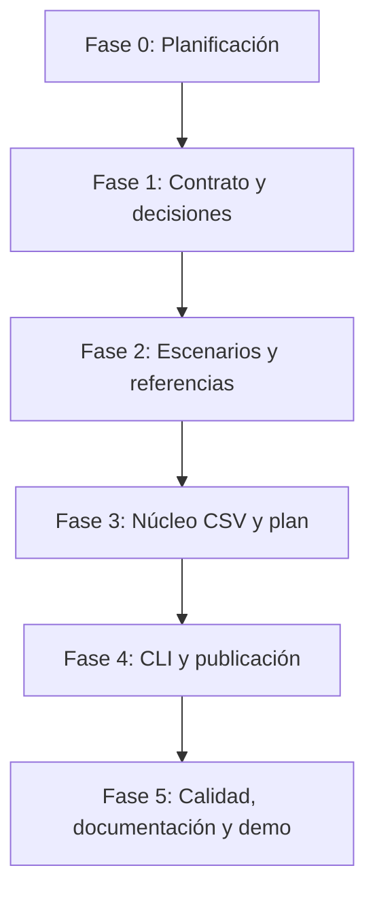

# Roadmap — Limpiador de datos CSV

## Estado y propósito

**Estado actual: v1 entregable — Fases 0 a 5 completadas.** El núcleo CSV, la validación del plan, la CLI `clean`, la publicación no destructiva, las referencias, la documentación y la demo local están verificados sin dependencias, red ni secretos.

El proyecto Día 08 está confirmado en [`README.md`](../../README.md) como un limpiador de datos CSV en Python. La decisión de producto aprobada para esta planificación es construir una CLI local que perfile un único CSV, aplique un plan de limpieza explícito y conservador, y publique un CSV limpio junto con un resumen JSON, sin sobrescribir el archivo de origen.

Este roadmap traduce ese alcance a una secuencia ejecutable. No constituye aún un contrato de comportamiento: las decisiones marcadas como pendientes deben cerrarse antes de crear código, dependencias, configuraciones, fixtures o pruebas funcionales.

## Visión de la primera versión

Una persona que recibe un CSV con problemas mecánicos podrá inspeccionarlo y aplicar una limpieza limitada, auditable y no destructiva. El resultado será útil como preparación local para análisis posterior, no como plataforma ETL, herramienta de calidad de datos semántica ni sustituto de revisión humana.

La entrega debe caber en el límite del reto. Conforme a [`docs/DAILY_WORKFLOW.md`](../../docs/DAILY_WORKFLOW.md), el flujo principal local, las entradas, salidas y la demo deberán quedar definidos antes de T0; el alcance se reducirá antes de T+90 si el flujo feliz no está validado y se congelará en T+120.

## Principios rectores

1. **No destructivo por defecto.** El CSV origen no se sobrescribe, mueve ni borra.
2. **Plan explícito antes de transformar.** La herramienta no inventa ni ejecuta correcciones semánticas.
3. **Conservadurismo verificable.** Solo admite operaciones mecánicas que se documenten, prueben y contabilicen.
4. **Local primero.** No requiere red, credenciales, cuentas, cloud ni servicios de terceros; la ruta local es el producto y la demo.
5. **Contrato antes de implementación.** Semántica, bordes, errores y publicación se fijan antes de crear lógica o fixtures.
6. **Privacidad por minimización.** El informe y los diagnósticos describen estructura y contadores, no el contenido del CSV.
7. **Determinismo.** El orden de operaciones, los artefactos y los diagnósticos se especificarán para permitir regresión reproducible.
8. **Alcance atómico.** Se excluyen inferencia de tipos, corrección de negocio, lotes, formatos no CSV y conectores.

## Alcance controlado

### Resultado mínimo viable

- Ejecutar una CLI local sobre un CSV y un plan válidos.
- Crear un perfil estructural agregado.
- Ejecutar las operaciones conservadoras que el contrato apruebe.
- Publicar un CSV limpio en una ruta separada.
- Publicar un resumen JSON con el plan efectivo, contadores y advertencias.
- Probar y demostrar el flujo sin red ni secretos.

### Exclusiones que no deben entrar en la v1

- Sobrescritura del origen, persistencia de historial, telemetría, base de datos o cuentas de usuario.
- Pandas u otra dependencia de terceros sin justificación documentada.
- Corrección, imputación, deduplicación difusa, clasificación, enriquecimiento, detección de anomalías o inferencias de negocio.
- Directorios, lotes, programación, API web, UI gráfica, integración cloud o ficheros distintos de CSV.
- Exportación a XLSX, Parquet o JSON como producto de limpieza.

## Decisiones de producto y técnicas

| Tema | Alternativas | Recomendación para la v1 | Consecuencia |
|---|---|---|---|
| Interfaz | CLI, API, UI web | CLI local | Menor tiempo de entrega y fácil prueba reproducible. |
| Motor CSV | Biblioteca estándar, `pandas` | Biblioteca estándar (`csv`, `json`, `pathlib`) | Cero instalación externa y control explícito; limita el alcance a limpieza mecánica. |
| Plan | JSON, YAML, flags con reglas | JSON declarativo | Validación simple, portable y versionable sin dependencia adicional. |
| Ejecución | Limpieza automática, plan explícito | Plan explícito | Evita pérdida de datos por inferencias; añade una entrada al flujo. |
| Publicación | Sobrescribir, salida separada | Salidas separadas | Protege el origen y permite revisión; exige validar conflictos de rutas. |
| Procesamiento | Memoria completa, streaming | Pendiente de límites; preferir solución más simple que satisfaga el fixture y el contrato | La decisión depende de tamaños objetivo y debe tomarse antes del núcleo. |
| Perfil | Contenido detallado, métricas agregadas | Métricas agregadas | Reduce exposición de datos sensibles en el JSON. |

No se tomarán decisiones irreversibles sobre formato, compatibilidad, límites o semántica de transformaciones sin registrarlas en la Fase 1.

## Arquitectura conceptual y dependencias

La Fase 1 bloquea todas las fases técnicas. La Fase 2 bloquea el desarrollo del núcleo para asegurar que los casos y expectativas preceden a la lógica. La Fase 4 depende de que el núcleo pueda ejecutar y medir el plan. La Fase 5 solo puede cerrar cuando el flujo local funciona desde una copia limpia y la documentación describe el comportamiento implementado, no el deseado.

| Módulo futuro | Responsabilidad | Depende de |
|---|---|---|
| `src/main.py` | CLI, argumentos, coordinación, códigos de salida y mensajes seguros. | Núcleo y contrato. |
| `src/csv_profile.py` | Lectura y perfil estructural del CSV admitido. | Dialecto, codificación y límites definidos. |
| `src/plan.py` | Modelo y validación del plan JSON. | Esquema contractual. |
| `src/cleaner.py` | Aplicación ordenada de transformaciones y métricas. | Plan validado y semántica de operaciones. |
| `src/output.py` | Publicación controlada de CSV y resumen JSON. | Política de rutas, colisiones y resultados. |
| `tests` | Unitarias, integración, regresión y seguridad operativa. | Escenarios y referencias. |
| `data/fixtures` y `data/expected` | Entradas sintéticas y resultados de referencia. | Contrato y escenarios aprobados. |

Los nombres son una propuesta documental: no se crearán archivos funcionales hasta las fases correspondientes.

## Fases de trabajo

### Fase 0 — Base documental y alcance

**Estado:** completada en esta tarea.

**Objetivo:** analizar el repositorio, confirmar la única información disponible sobre el Día 08, acordar la dirección de producto y documentar el punto de partida sin introducir comportamiento funcional.

**Entregables:** [`README.md`](README.md) y este [`ROADMAP.md`](ROADMAP.md).

**Criterios de finalización:**

- El propósito, alcance, exclusiones, usuarios, entradas, salidas, riesgos y ambigüedades están documentados.
- La decisión de CLI local con plan explícito, CSV limpio y resumen JSON está diferenciada de la información confirmada en el índice global.
- Solo se han creado o modificado documentos Markdown del proyecto.

**Validación:** revisión manual contra [`README.md`](../../README.md), [`projects/_templates/README.template.md`](../_templates/README.template.md) y [`docs/DAILY_WORKFLOW.md`](../../docs/DAILY_WORKFLOW.md).

### Fase 1 — Contrato de CSV, plan y publicación

**Estado:** completada.

**Objetivo:** eliminar las ambigüedades que afectarían a los resultados antes de implementar o generar datos de prueba.

**Tareas prioritarias:**

- Definir las versiones de Python y plataformas objetivo.
- Especificar codificación, BOM, delimitador, comillas, escape, terminadores y política de dialecto.
- Determinar si la primera fila es siempre encabezado, cómo se preserva su orden y qué hacer con encabezados vacíos o duplicados.
- Definir valores faltantes, fila vacía, duplicado exacto, espacios recortables y reglas de normalización de encabezados.
- Aprobar operaciones v1, parámetros, precondiciones, orden de aplicación, contadores y condiciones de rechazo.
- Definir el esquema y versionado del plan JSON, incluida la política frente a campos desconocidos.
- Definir las claves y la política de privacidad del resumen JSON.
- Establecer entradas CLI, salidas, códigos de retorno, rutas relativas, conflictos, permisos, archivos temporales e interrupciones.
- Resolver la política de celdas con prefijos que una hoja de cálculo podría interpretar como fórmula.
- Fijar límites de tamaño, filas y columnas; decidir memoria completa frente a streaming.

**Entregables:** contrato en [`docs/CONTRATO.md`](docs/CONTRATO.md) y actualización de [`README.md`](README.md).

**Dependencias:** Fase 0 completada.

**Criterios de finalización:**

- Cada entrada válida, transformación, salida y error importante tiene semántica inequívoca.
- Un desarrollador puede determinar si un plan es válido y predecir el resultado sin inferir reglas de negocio.
- La protección del origen y de las rutas de salida está especificada.
- Se han resuelto los límites suficientes para seleccionar el enfoque de procesamiento.
- Aún no se añade código, fixture, dependencia o configuración ejecutable.

**Hito H1:** contrato v1 aprobado.

**Resultado:** [`docs/CONTRATO.md`](docs/CONTRATO.md) aprueba Python 3.11+ sobre Windows 11, CSV UTF-8/UTF-8 con BOM delimitado por comas, encabezado obligatorio, límites de 10 MiB, 10 000 filas y 100 columnas, y procesamiento en memoria. También fija el plan JSON `version: 1`, sus cinco operaciones conservadoras y orden estable, el perfil y resumen JSON sin contenido de celdas, la política de campos similares a fórmulas, la futura CLI `clean`, rutas y publicación no destructiva, códigos de salida y exclusiones. No se añadieron dependencias, fixtures, resultados de referencia, configuración ni implementación funcional; los módulos y pruebas reservados continúan vacíos.

### Fase 2 — Escenarios, fixtures y referencias

**Estado:** completada.

**Objetivo:** convertir el contrato en casos trazables, sintéticos y reproducibles antes de desarrollar el núcleo.

**Tareas prioritarias:**

- Diseñar un catálogo que relacione cada requisito y operación con al menos un escenario.
- Crear CSV sintéticos para flujo feliz, filas vacías, espacios, valores faltantes, duplicados, encabezados y dialectos aprobados.
- Preparar planes JSON válidos, inválidos e incompatibles con el perfil.
- Crear CSV limpios y resúmenes JSON de referencia según el contrato.
- Diseñar escenarios de rutas en conflicto, CSV malformado, codificación no admitida, permisos y publicación interrumpida cuando el entorno lo permita.
- Asegurar que ningún fixture o referencia contiene datos personales, secretos o datos productivos.

**Entregables previstos:** catálogo de escenarios, fixtures bajo `data/fixtures`, referencias bajo `data/expected` y trazabilidad documental en `docs`.

**Dependencias:** contrato H1 aprobado.

**Criterios de finalización:**

- Cada RF-01 a RF-09 del README tiene cobertura de escenario definida.
- Los escenarios distinguen éxito, rechazo previo a publicación y fallo durante publicación.
- Las referencias permiten detectar cambios de contenido, orden, métricas y JSON sin inspección manual.
- Los datos son pequeños, inocuos y aptos para demo local.

**Hito H2:** matriz requisito–escenario–referencia aprobada.

**Resultado:** [`docs/ESCENARIOS_FASE_2.md`](docs/ESCENARIOS_FASE_2.md) establece la matriz de trazabilidad de RF-01 a RF-09 y separa éxito, rechazo previo a publicación y fallo durante publicación. [`data/fixtures/scenario-catalog.json`](data/fixtures/scenario-catalog.json) cataloga los casos; `data/fixtures` contiene CSV y planes JSON sintéticos, y `data/expected` fija dos CSV limpios, dos resúmenes JSON deterministas y categorías de error. Las rutas, permisos, límites e interrupciones que no son portables se describen para creación efímera en pruebas posteriores. No se añadió implementación, dependencia, configuración ejecutable ni prueba funcional; los módulos y pruebas reservados continúan vacíos.

### Fase 3 — Núcleo de lectura, perfilado y limpieza

**Estado:** completada.

**Objetivo:** implementar un núcleo desacoplado de la CLI que interprete el CSV acordado, valide el plan y produzca resultados estructurados y deterministas.

**Tareas prioritarias:**

- Implementar lectura y validación de CSV conforme al contrato.
- Implementar el perfil estructural con métricas agregadas autorizadas.
- Implementar el modelo y la validación del plan JSON.
- Implementar las transformaciones v1 con orden contractual y contadores por operación.
- Producir un resultado interno que no escriba archivos, no formatee diagnósticos y no incluya contenido innecesario del CSV.
- Crear pruebas unitarias de cada operación, bordes, orden, perfil, plan y restricciones de seguridad.

**Entregables previstos:** módulos bajo `src`, pruebas unitarias bajo `tests` y cualquier precisión documental necesaria que no amplíe el contrato.

**Dependencias:** H2 completado.

**Criterios de finalización:**

- Todos los escenarios contractuales del núcleo pasan o se rechazan de forma controlada.
- La limpieza no requiere red, credenciales ni dependencias no aprobadas.
- Las transformaciones no alteran datos fuera de su semántica aprobada.
- El resultado interno permite construir CSV y resumen sin repetir la lógica.
- Las pruebas protegen contra regresiones de orden, contadores y conservación del contenido no afectado.

**Hito H3:** núcleo validado contra referencias.

**Resultado:** [`src/csv_profile.py`](src/csv_profile.py), [`src/plan.py`](src/plan.py) y [`src/cleaner.py`](src/cleaner.py) implementan el núcleo en memoria y sin E/S de publicación: lectura estricta UTF-8/UTF-8 BOM con dialecto de coma, límites y perfil agregado; validación cerrada del plan JSON v1 y orden contractual; y transformaciones con contadores deterministas. Las pruebas unitarias bajo [`tests`](tests) comparan los escenarios de éxito con las referencias de Fase 2, ejercitan rechazos controlados y confirman que un punto y coma es contenido válido de un campo bajo el dialecto de coma, sin autodetección ni rechazo por inspección.

### Fase 4 — CLI, publicación no destructiva e informes

**Estado:** completada.

**Objetivo:** exponer el núcleo mediante la CLI mínima y completar el flujo de artefactos de extremo a extremo.

**Tareas prioritarias:**

- Implementar argumentos acordados para origen, plan, CSV limpio y resumen.
- Validar rutas, relaciones peligrosas, permisos y existencia de salidas antes de procesar o publicar.
- Coordinar perfilado, validación, limpieza, publicación y resumen sin duplicar reglas del núcleo.
- Implementar publicación segura de dos salidas, tratamiento de colisiones y limpieza de artefactos propios ante errores.
- Establecer mensajes, stderr/stdout y códigos de salida estables sin mostrar datos sensibles.
- Crear pruebas de subproceso para flujo feliz, errores de argumentos, rechazo de plan, conflictos y fallos de escritura.

**Entregables previstos:** CLI funcional, publicación de resultados, pruebas de integración, guía de uso local y evidencia de ejecución.

**Dependencias:** H3 completado.

**Criterios de finalización:**

- La ejecución desde la CLI genera ambos artefactos para un fixture válido.
- El origen permanece intacto en éxito y error.
- Un error antes de publicar no deja resultados presentados como completos; un error parcial se maneja según el contrato.
- El resumen JSON coincide con el plan y los cambios efectivos.
- La CLI se puede usar con instrucciones limpias sin red o secretos.

**Hito H4:** flujo local de extremo a extremo comprobado.

**Resultado:** [`src/main.py`](src/main.py) expone el único comando contractual `clean` y coordina validación de rutas, carga, plan, limpieza y publicación. [`src/output.py`](src/output.py) rechaza colisiones y rutas no admisibles antes de procesar, prepara ambos artefactos en temporales propios y elimina resultados propios si la segunda publicación falla. [`tests/test_cli.py`](tests/test_cli.py) cubre subprocesos de éxito, ausencia de cambios, argumentos inválidos, entradas o rutas rechazadas y un fallo de publicación inyectado. La guía [`examples/USO.md`](examples/USO.md) documenta un flujo local reproducible sin dependencias ni red.

### Fase 5 — Calidad, documentación, demo y entrega

**Estado:** completada.

**Objetivo:** cerrar una entrega pequeña, verificable, segura y publicable que represente solo el comportamiento implementado.

**Tareas prioritarias:**

- Ejecutar la suite unitaria, integración y regresión desde una copia limpia.
- Revisar origen intacto, determinismo, rutas, publicación, límites y privacidad de informes y errores.
- Revisar dependencias, secretos, fixtures, artefactos temporales y archivos no deseados.
- Actualizar README, contrato, guía de uso y referencias para reflejar decisiones finales.
- Preparar una demo local de hasta 15 segundos que muestre CSV de entrada sintético, plan, acción, CSV limpio y resumen, conforme a [`docs/DAILY_WORKFLOW.md`](../../docs/DAILY_WORKFLOW.md).
- Actualizar el índice global y material de publicación solo con enlaces y resultado verificables.

**Dependencias:** H4 completado.

**Criterios de finalización:**

- El flujo principal pasa todas las pruebas previstas y cuenta con guion manual reproducible.
- La documentación explica instalación, uso, límites, errores, plan, salida, seguridad y cualquier fallback real.
- No hay secretos, datos personales ni artefactos de ejecución versionados.
- La entrega cumple la Definition of Done aplicable en [`docs/DAILY_WORKFLOW.md`](../../docs/DAILY_WORKFLOW.md).

**Hito H5:** versión v1 entregable.

**Resultado:** [`tests/test_delivery.py`](tests/test_delivery.py) añade regresión de ejecuciones repetidas byte a byte, preservación del origen, límite de tamaño, privacidad de diagnósticos y presencia de los artefactos de entrega. [`docs/VERIFICACION_FASE_5.md`](docs/VERIFICACION_FASE_5.md) deja la secuencia de verificación limpia; [`examples/USO.md`](examples/USO.md) cubre éxito, ausencia de cambios, error y limpieza; [`assets/DEMO_15S.md`](assets/DEMO_15S.md) define una demo local de hasta 15 segundos; y [`docs/LINKEDIN_DIA_08.md`](docs/LINKEDIN_DIA_08.md) contiene únicamente afirmaciones comprobables. README, contrato y el índice global reflejan la v1 entregable y sus límites reales.

## Priorización y gestión de tiempo

| Prioridad | Elementos |
|---|---|
| P0 — indispensables | Contrato, CLI local, un dialecto/encoding bien definido, perfil mínimo, plan JSON validado, 2–4 operaciones conservadoras, CSV separado, resumen JSON, pruebas del flujo feliz y origen intacto. |
| P1 — solo si P0 está validado | Más escenarios de error, mejoras de diagnóstico, compatibilidad adicional dentro de CSV, demo pulida y métricas adicionales no sensibles. |
| P2 — fuera de la entrega diaria | Streaming avanzado, múltiples dialectos, UI, API, inferencia de tipos, limpieza semántica, formatos adicionales y conectores. |

**Puertas operativas:**

- **Antes de T0:** seleccionar el conjunto mínimo de operaciones, un fixture y los artefactos de salida.
- **T+30:** validar lectura y escritura local del CSV; no hay integración externa que justifique fallback.
- **T+90:** si el flujo completo no está listo, reducir operaciones al mínimo y eliminar compatibilidad avanzada, no la protección del origen ni el resumen.
- **T+120:** congelar alcance y corregir solo bloqueos de flujo principal, prueba, documentación o demo.

## Estrategia de validación y pruebas

| Capa | Validación |
|---|---|
| Contrato | Revisión de entradas, salidas, semántica, errores, límites y trazabilidad. |
| Perfilado | Dimensiones, encabezados, métricas agregadas y CSV inválido según fixtures. |
| Plan | Esquema, versión, operaciones desconocidas, parámetros, precondiciones y orden. |
| Transformaciones | Caso aislado por operación, combinación, idempotencia cuando corresponda y preservación de datos no afectados. |
| Publicación | Rutas separadas, conflictos, permisos, resultados existentes, errores inyectados y limpieza de temporales propios. |
| Integración CLI | Argumentos, códigos de salida, stdout/stderr, flujo feliz y diagnósticos seguros. |
| Regresión | Comparación de CSV y JSON con referencias sintéticas aprobadas. |
| Seguridad | Ausencia de red, secretos, logs de valores, modificación del origen y riesgos de interpretación no documentados. |
| Rendimiento | Medición contra límites fijados; no prometer escalabilidad no comprobada. |
| Documentación | Coherencia entre README, contrato, ejemplos, resultados observados y demo. |

La suite de pruebas será local y no dependerá de servicios externos. Si se incorporase una dependencia de terceros por decisión posterior, deberá declararse de forma aislada y justificarse frente al coste de tiempo del reto.

## Riesgos y mitigaciones

| Riesgo | Probabilidad / impacto | Mitigación y señal de activación |
|---|---|---|
| CSV con dialecto, encoding o estructura ambigua | Alta / alta | Restringir y documentar soporte v1; rechazar entradas fuera de contrato en lugar de adivinar. |
| Transformación que altera significado de negocio | Media / alta | Plan explícito, lista mínima de operaciones y salida separada; no implementar inferencias. |
| Colisiones tras normalizar encabezados | Media / alta | Decidir y probar rechazo o política determinista antes de Fase 2. |
| Sobrescritura o publicación parcial | Media / alta | Validación previa de rutas, estrategia temporal y pruebas de fallos; el origen nunca es destino. |
| Datos sensibles en resumen, prueba o demo | Media / alta | Solo fixtures sintéticos, métricas agregadas, revisión de contenido y prohibición de logs de celdas. |
| Límite diario insuficiente | Alta / media | Priorizar P0 y activar reducción en T+90; no añadir `pandas`, UI ni dialectos avanzados sin necesidad. |
| Archivo demasiado grande | Media / media | Establecer límites y decidir procesamiento antes de Fase 3; rechazar tamaños no soportados de forma clara. |
| Riesgo al abrir CSV resultante en hoja de cálculo | Media / media | Fijar política de CSV injection antes de implementación y documentar sus consecuencias. |
| Pruebas dependientes de plataforma | Media / media | Preferir escenarios portables, condicionar permisos solo donde aplique y documentar la plataforma objetivo. |

## Criterios transversales de calidad

- **Claridad:** mensajes accionables, contrato explícito y guía reproducible.
- **Trazabilidad:** cada requisito se vincula a escenarios, pruebas y resultados de referencia.
- **Mantenibilidad:** módulos con responsabilidad única y transformaciones aisladas de E/S.
- **Determinismo:** orden de plan, serialización JSON y resultados documentados.
- **Seguridad:** origen protegido, sin red, sin secretos y sin exposición innecesaria de celdas.
- **Rendimiento honesto:** límites definidos, medidos y documentados; no se afirma soporte de volúmenes no probados.
- **Observabilidad proporcionada:** resumen JSON agregado y estados CLI, sin sistema de telemetría externo.

## Bloqueos y decisiones que deben resolverse

No debe comenzar la Fase 2 ni la implementación hasta cerrar en el contrato:

1. Soporte exacto de dialecto y codificación CSV.
2. Reglas de encabezados, valores faltantes, filas vacías, espacios y duplicados.
3. Esquema, versionado y lista cerrada de operaciones del plan JSON.
4. Política para datos con posible interpretación de fórmula por clientes de hojas de cálculo.
5. Límites de recurso y método de procesamiento.
6. Política de colisión de rutas, salidas existentes, publicación y recuperación ante error.
7. Formato de resumen JSON, campos permitidos y códigos de retorno.

## Definición de terminado de la v1

La entrega podrá declararse terminada cuando se cumplan simultáneamente los siguientes puntos:

- El contrato v1 y las decisiones anteriores estén aprobados y reflejados en la documentación.
- La CLI local ejecute un plan válido sobre un CSV admitido y produzca CSV limpio y resumen JSON separados.
- El origen no cambie en todas las rutas de éxito y fallo cubiertas.
- Las operaciones implementadas se correspondan exactamente con el contrato, estén medidas y tengan pruebas.
- Los fixtures, referencias y demo sean sintéticos, seguros y reproducibles sin red ni credenciales.
- La suite estándar pase desde una instalación limpia y la documentación coincida con el comportamiento efectivo.
- Se complete la Definition of Done del reto aplicable en [`docs/DAILY_WORKFLOW.md`](../../docs/DAILY_WORKFLOW.md).
